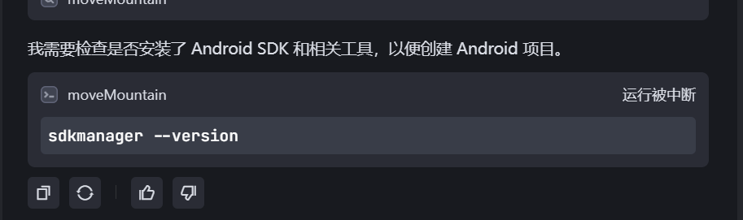

# myvibecoding
记录一下vibecoding的过程

在微信视频里刷到了一个项目讲怎么做vibecoding    https://github.com/automata/aicodeguide

不能直接让一个coding的agent开始写代码，先和一个LLM一个问题一个问题的聊，aicodeguide里是chatgpt，不过国内上chatgpt太难了，我用了deepseek，聊需求很顺利，deepseek显得很专业。只有最后输出markdown格式的时候折腾了几遍，最后我发现直接复制就行。
给deepseek的题目是写一个android上的目标管理器，源自我之前找这类软件的经历，手机上的软件为了满足大量用户的各类需求以及自己的经营需要，会在软件里放很多奇奇怪怪的东西，我只想要一个每日目标管理器，尝试了几个软件都不合适。这次正好试试自己写一个。这是我和deepseek沟通需求的经过：

https://chat.deepseek.com/share/3otdvkwk3emmnzugfb

和deepseek沟通完后会得到两个文档：
spec.md:prd需求文档
todo.md: 任务计划文档

下面是选个AIcoder开始根据文档写代码，我一开始选的是TraeCN，因为它免费。

我把任务发给Trae：

研究 spec.md 和 todo.md ，补充 和 todo.md 缺少的部分，并按照依赖顺序执行每个开发任务。每完成一个任务，就在 todo.md 中对应的任务条目后面写上已完成。

它认真分析了材料，并且在todo.md里插入了一个新的任务4.2，不过没改后续的任务编号，导致我的todo.md里出现了两个4.2。可惜我不懂android开发，看不懂加的4.2合不合理。
它很聪明的先看环境对不对，然后就卡在了这一步

我的电脑上确实没有android开发环境，不过它似乎是卡在了mcp调用terminal上，没有真的执行这个命令。

然后我更换了cursor（免费试用~~）  

cursor压根没管环境对不对，开始创建文件夹、创建文件、写代码了。不过我在cursor工作的时候手动装了android studio，所以不知道curser会不会自己装依赖项。
哦，cursor发现了todo.md里有两个4.2，然后他把其中一个改成了4.7，但是没调位置，现在文件里的格式乱了。

cursor的terminal操作需要每次授权，应该有个mcp的统一授权接口，我还没找。不过看起来它调用terminal没什么问题。

cursor会自己劈里啪啦写代码，修bug，执行一段时间会来询问用户后续工作量比较大，要不要继续，还是先测一下前面的代码。可以在聊天窗口里说自己的意见，这个vibe的感觉对了！

糟了，vibe的正舒服的时候，cursor和我说要升级pro。消费20刀~

cusor好慢，而且有种越用越慢的感觉，经常报链接失败，cursor有套路

cursor慢的原因找到了，和vpn有关系，经过一通尝试，有效的方法是把vpn设置成全局模式，并打开TUN模式。把cursor的http2.0改成1.1实测没用。

记录一些好玩的东西

https://github.com/buhe/build-your-own-x-zh
https://github.com/FoundationAgents/MetaGPT
